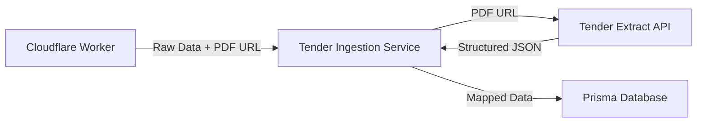

# Tender Ingestion & Extraction Integration Guide

## Overview

This guide details how the **Tender Extract API** interfaces with the main **Tender Ingestion Service** within the Tenders-SA pipeline. The extraction service acts as an enhancement layer, converting raw PDF documents into structured data to enrich the core `Tender` records.

## Integration Architecture

## Integration Workflow

1.  **Ingestion Trigger**: The `TenderIngestionService` receives a new tender payload from the Cloudflare Worker. This payload typically contains basic metadata (title, link) and the URL to the full tender PDF.
2.  **Extraction Request**:
    *   The service calls `POST /v1/extract` on the Tender Extract API.
    *   IT SHOULD prefer the **URL Fetch** mode (`{"url": "..."}`) to offload bandwidth usage, unless the PDF has already been downloaded for other reasons.
3.  **Data Merging**:
    *   The `ExtractResponse` is merged with the initial Cloudflare payload.
    *   **Priority Rule**: Data extracted from the PDF (e.g., specific closing time, briefing session) generally takes precedence over generic metadata, *unless* the extraction confidence is low (< 0.5).
4.  **Persistence**: The merged data is mapped to the Prisma schema (see Data Mapping below) and saved securely.

## Data Mapping Strategy

The `FieldMappingService` in the main application is responsible for mapping `ExtractResponse` fields to the `Tender` Prisma model.

| Extract API Field | Prisma `Tender` Model Field | Notes |
| :--- | :--- | :--- |
| `description` | `description` | Primary source for description. |
| `tender_number` | `tenderNumber` | Validate against existing pattern. |
| `title` | `title` | Fallback if source title is generic. |
| `closing_date` | `closingDate` | **Critical**: Parse to `DateTime`. |
| `closing_time` | `closingTime` | text field, separate from date. |
| `issuing_organization`| `authority` | Map to `Authority` relation if possible. |
| `estimated_value` | `estimatedValue` | Needs currency parsing/normalization. |
| `bbbee.minimum_level`| `minBeeLevel` | Parse "Level 1" -> `1`. |
| `briefing_session` | `siteMeeting` (JSON) | Store full object in JSONB column. |
| `contact` | `contactPerson` (JSON) | Store full object in JSONB column. |

## Error Handling & Fallbacks

Since PDF extraction is probabilistic (regex-based):

1.  **Extraction Failure (5xx/4xx)**:
    *   The ingestion pipeline **MUST NOT** fail completely.
    *   Log the error.
    *   Proceed with ingestion using only the basic metadata from Cloudflare.
    *   Flag the tender as `extraction_failed` for manual review (if such a flag exists) or simply omit the enhanced fields.

2.  **Low Confidence**:
    *   If `confidence` < 0.5, treat extracted fields as "suggestions" or discard highly sensitive fields (like dates) in favor of the source metadata if available.

3.  **Scanned PDFs (501)**:
    *   The API explicitly rejects scanned images. The ingestion service should handle this gracefully (e.g., "Content depends on scanned PDF - see attachment").
